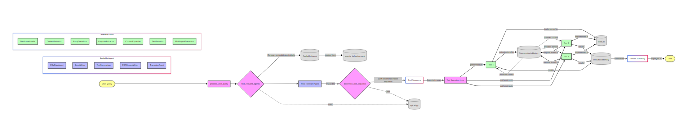
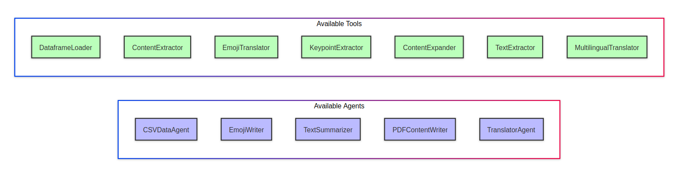
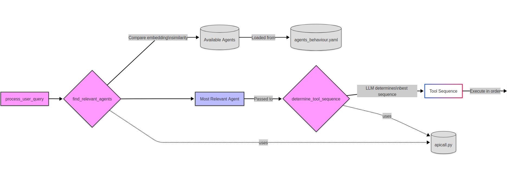
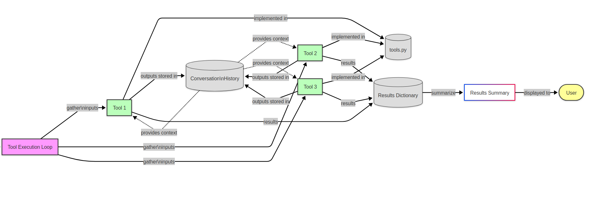
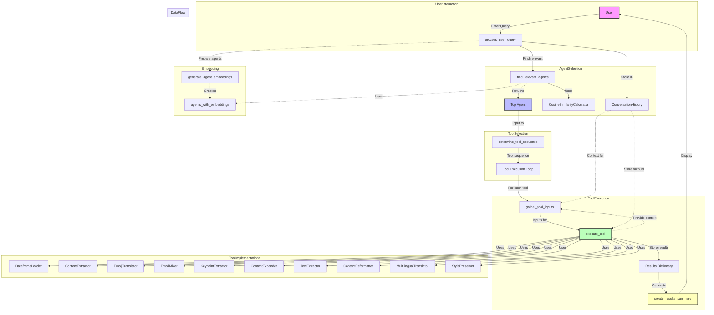

## List of Agent and Tools

## Query to SeqOfTaskCall

## Tools Calling

## FLow Diagram

```mermaid
flowchart TD
    subgraph UserInteraction
        A[User] -->|"Enter Query"| B[process_user_query]
    end
    
    subgraph AgentSelection
        B -->|"Store in"| C[ConversationHistory]
        B -->|"Find relevant"| D[find_relevant_agents]
        D -->|"Uses"| E[CosineSimilarityCalculator]
        D -->|"Returns"| F[Top Agent]
    end
    
    subgraph ToolSelection
        F -->|"Input to"| G[determine_tool_sequence]
        G -->|"Tool sequence"| H[Tool Execution Loop]
    end
    
    subgraph ToolExecution
        H -->|"For each tool"| I[gather_tool_inputs]
        I -->|"Inputs for"| J[execute_tool]
        J -->|"Store results"| K[Results Dictionary]
        K -->|"Generate"| L[create_results_summary]
    end

    subgraph DataFlow
        C -.->|"Context for"| I
        C -.->|"Store outputs"| J
        J -.->|"Provide context"| I
    end
    
    subgraph ToolImplementations
        J -->|"Uses"| T1[DataframeLoader]
        J -->|"Uses"| T2[ContentExtractor]
        J -->|"Uses"| T3[EmojiTranslator]
        J -->|"Uses"| T4[EmojiMixer]
        J -->|"Uses"| T5[KeypointExtractor]
        J -->|"Uses"| T6[ContentExpander]
        J -->|"Uses"| T7[TextExtractor]
        J -->|"Uses"| T8[ContentReformatter]
        J -->|"Uses"| T9[MultilingualTranslator]
        J -->|"Uses"| T10[StylePreserver]
    end
    
    subgraph Embedding
        B -.->|"Prepare agents"| Z[generate_agent_embeddings]
        Z -.->|"Creates"| Y[agents_with_embeddings]
        D -.->|"Uses"| Y
    end
    
    L -->|"Display"| A

    style A fill:#f9f,stroke:#333,stroke-width:2px
    style F fill:#bbf,stroke:#333,stroke-width:2px
    style J fill:#bfb,stroke:#333,stroke-width:2px
    style L fill:#ffb,stroke:#333,stroke-width:2px

```

## Embedd SVG
## Embedded SVG

