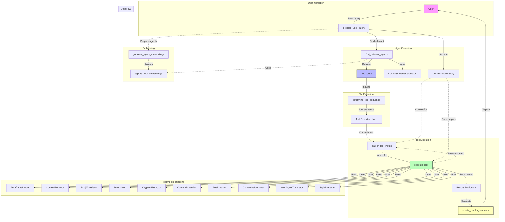

# Agents Manager

An intelligent multi-agent system that automatically selects the best agent and tool sequence to handle user queries. The system uses semantic similarity to match user requests with specialized agents, each equipped with specific tools for different tasks.

## Features

- **Intelligent Agent Selection**: Uses cosine similarity with embeddings to find the most relevant agent for each query
- **Multi-Tool Orchestration**: Automatically determines the optimal sequence of tools to complete tasks
- **Conversation Context**: Maintains conversation history to provide context-aware responses
- **Specialized Agents**: Five distinct agents, each with specialized capabilities:
  - CSV Data processing and analysis
  - Emoji content creation and translation
  - Text summarization and expansion
  - PDF content extraction and reformatting
  - Multilingual translation with style preservation

## Quick Start

### Prerequisites
- Python 3.12+
- UV package manager

### Installation

1. **Install dependencies:**
   ```bash
   uv sync
   ```

2. **Environment setup:**
   Create a `.env` file with your OpenAI configuration:
   ```env
    OPENAI_API_KEY=your_api_key_here
    BASE_URL_OPENAI= "https://api.openai.com/v1"
    MODEL_NAME= "gpt-4o"
    EMBEDDING_MODEL_NAME ="text-embedding-3-large"
   ```
   See `apicall.py` for configuration details.

3. **Run the application:**
   ```bash
   # Using UV
   uv run final_version.py
   
   # Or activate the environment and run directly
   source .venv/bin/activate  # or .venv\Scripts\activate on Windows
   python final_version.py
   ```

## How It Works


### Core Workflow

1. **User Query Processing**: The system receives and processes user input
2. **Agent Selection**: Uses semantic similarity to find the most relevant agent
3. **Tool Sequence Planning**: Determines the optimal sequence of tools to use
4. **Tool Execution**: Executes tools in sequence, passing context between them
5. **Result Generation**: Provides comprehensive results to the user

## List of Agents and Tools


### Available Agents

#### 1. CSVDataAgent
**Purpose**: CSV data loading, processing, and analysis
- **DataframeLoader**: Loads CSV/Excel files into pandas DataFrames
- **AdvanceCSVQuery**: Performs complex queries and filtering on CSV data

#### 2. EmojiWriter
**Purpose**: Emoji content creation and translation
- **EmojiTranslator**: Converts text and concepts to relevant emojis
- **EmojiMixer**: Creates custom emoji combinations from multiple concepts

#### 3. TextSummarizer
**Purpose**: Text analysis and content expansion
- **KeypointExtractor**: Identifies key points and main ideas from text
- **ContentExpander**: Expands bullet points into full paragraphs

#### 4. PDFContentWriter
**Purpose**: PDF processing and content reformatting
- **TextExtractor**: Extracts text content from PDF files
- **ContentReformatter**: Reformats content into various document types

#### 5. TranslatorAgent
**Purpose**: Multilingual translation with style preservation
- **MultilingualTranslator**: Translates content between multiple languages
- **StylePreserver**: Maintains writing style during translation

## Architecture Overview

### Query Processing Flow


### Tool Execution


## Flow Diagram



## Key Components

### Core Files

- **`final_version.py`**: Main application entry point with agent selection logic
- **`tools.py`**: Implementation of all tools used by agents
- **`agents_behaviour.yaml`**: Configuration file defining agents and their capabilities
- **`apicall.py`**: OpenAI API integration and embedding generation
- **`prompts.py`**: Prompt templates for various system interactions

### Configuration

The system is configured through `agents_behaviour.yaml`, which defines:
- Agent descriptions and capabilities
- Tool specifications and versions
- Input/output schemas for each tool
- Agent-specific parameters

### Conversation Management

- Maintains conversation history in `conversation_history.json`
- Provides context to subsequent tool executions
- Enables multi-turn conversations with memory

## Example Usage

```python
# Example queries the system can handle:

# CSV Data Analysis
"Load the earthquake.csv file and show me the top 10 earthquakes by magnitude"

# Content Translation
"Translate this text to Spanish: 'Hello, how are you today?'"

# PDF Processing
"Extract text from my resume.pdf and reformat it as a LinkedIn summary"

# Emoji Content
"Convert this sentence to emojis: 'I love sunny days at the beach'"

# Text Summarization
"Extract key points from this article and expand them into a full summary"
```

## Technical Details

### Dependencies
- **Pandas**: Data manipulation and analysis
- **OpenAI**: Language model integration
- **PyMuPDF**: PDF text extraction
- **Pydantic**: Data validation and type safety
- **NumPy**: Numerical computations
- **PyYAML**: Configuration file parsing

### Similarity Threshold
- Agents are selected only if similarity score > 0.5
- If no agent meets the threshold, falls back to general chat

### Extensibility
- Easy to add new agents by updating `agents_behaviour.yaml`
- New tools can be implemented in `tools.py`
- Modular architecture supports rapid development

## Development

### Project Structure
```
agents_manager/
├── final_version.py          # Main application
├── tools.py                  # Tool implementations
├── agents_behaviour.yaml     # Agent configuration
├── apicall.py               # OpenAI integration
├── prompts.py               # Prompt templates
├── pyproject.toml           # Project dependencies
├── docs/                    # Documentation
├── images/                  # Flow diagrams
└── tool/                    # Additional tool scripts
```

### Adding New Agents
1. Define agent in `agents_behaviour.yaml`
2. Implement tools in `tools.py`
3. Update tool mapping in `final_version.py`
4. Test with relevant queries

## Troubleshooting

### Common Issues
- **"No relevant agent found"**: Ensure your query matches one of the agent descriptions
- **API errors**: Check your OpenAI API configuration in `.env`
- **File path issues**: Use absolute paths or ensure files are in the working directory

### Debug Mode
Set conversation history to see detailed execution flow in `conversation_history.json`

## Contributing

1. Fork the repository
2. Create a feature branch
3. Add your agent/tool implementation
4. Update documentation
5. Submit a pull request

## License

This project is available under the MIT License.

